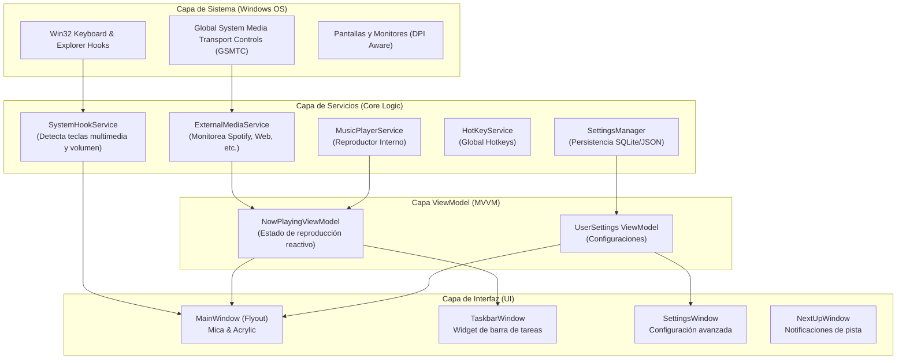

# FluentFlyout - Reproductor de Música Moderno


## 🎵 Descripción

**FluentFlyout** es un reproductor de música y controlador de medios de última generación para Windows, diseñado con los principios de **Fluent Design** de Microsoft. Ofrece una experiencia visualmente impresionante y fluida, integrándose perfectamente con la estética de Windows 11 mediante efectos de **Mica** y **Acrylic**.

> [!NOTE]
> Este proyecto es un fork de [unchihugo/FluentFlyout](https://github.com/unchihugo/FluentFlyout), con mejoras significativas en la arquitectura (MVVM completo), personalización y soporte para el reproductor interno.

La aplicación no solo funciona como un reproductor interno, sino que también actúa como un controlador universal para cualquier sesión de medios activa en el sistema (Spotify, YouTube, Navegadores, etc.), proporcionando un "Flyout" elegante para gestionar tu música sin interrumpir tu flujo de trabajo.

---

## 🙏 Reconocimiento al Creador Original

Este proyecto es una evolución y mejora de **[FluentFlyout](https://github.com/unchihugo/FluentFlyout)**, desarrollado originalmente por **[unchihugo](https://github.com/unchihugo)**. 

Queremos dar todo el crédito al autor original por la idea innovadora y la base técnica que hizo posible este reproductor. Si te gusta esta aplicación, por favor considera darle una estrella a su repositorio original para apoyar su trabajo.

---

## ✨ Características Principales

- **Diseño Premium**: Interfaz moderna con efectos de transparencia (Mica/Acrylic) y animaciones suaves.
- **Control Universal de Medios**: Sincronización en tiempo real con el Servicio Global de Control de Transporte de Medios (GSMTC) de Windows.
- **Arquitectura MVVM**: Refactorización completa utilizando `CommunityToolkit.Mvvm` para una lógica limpia y reactiva.
- **Modos Visuales Dinámicos**: Soporte completo para Temas Claro/Oscuro y colores de acento dinámicos basados en el arte del álbum.
- **Integración con la Barra de Tareas**: Widget personalizado en la barra de tareas para un control rápido.
- **Notificaciones "Next Up"**: Ventanas emergentes elegantes que muestran la siguiente pista antes de que comience.
- **Altamente Personalizable**: Ajustes de duración de visibilidad, posición en pantalla, teclas de acceso rápido y comportamientos de control.

---

## 🛠️ Tecnologías

- **Lenguaje**: C# / .NET 8
- **Framework UI**: WPF (Windows Presentation Foundation)
- **Librerías de Diseño**:
  - [WPF-UI](https://github.com/lepoco/wpfui) - Componentes Fluent modernos.
  - [MicaWPF](https://github.com/SimpLeischa/MicaWPF) - Soporte nativo para efectos de fondo de Windows 11.
- **Arquitectura**: MVVM (Model-View-ViewModel) con Community Toolkit.
- **Logging**: NLog para un seguimiento robusto de errores y eventos.

---

## 🚀 Instalación y Uso

### Requisitos

- Windows 10 (1809+) o Windows 11.
- .NET 8.0 Runtime o SDK.

### Ejecución desde el código

1. Clonar el repositorio:

   ```bash
   git clone https://github.com/Hugo-S-M-28/Reproductor-Musica.git
   ```

2. Abrir `FluentFlyout.sln` en Visual Studio 2022.
3. Restaurar los paquetes NuGet.
4. Establecer `FluentFlyoutWPF` como proyecto de inicio y presionar `F5`.

---

## 🏗️ Arquitectura y Funcionamiento Interno

### Diagrama de Arquitectura

El siguiente diagrama ilustra cómo fluyen los datos y eventos a través de las diferentes capas de la aplicación, desde las integraciones con el sistema operativo hasta la interfaz de usuario.



### Explicación en Profundidad

#### 1. Sincronización de Medios Híbrida

Una de las mayores fortalezas de FluentFlyout es su capacidad para manejar múltiples fuentes de audio simultáneamente. El `NowPlayingViewModel` actúa como un orquestador que:

- Prioriza el **reproductor interno** si hay una pista activa.
- Conmuta automáticamente a **sesiones externas** (como Spotify o YouTube) cuando el reproductor interno está inactivo.
- Escucha eventos del sistema para actualizar metadatos, imágenes de portada y la barra de progreso en tiempo real (cada 300ms).

#### 2. Integración de Nivel de Sistema

La aplicación utiliza técnicas avanzadas de interoperabilidad con Windows para sentirse como una parte nativa del sistema:

- **Hooks de Bajo Nivel**: Mediante `SystemHookService`, la aplicación intercepta las teclas de volumen y multimedia para mostrar el Flyout de forma inteligente, incluso si la aplicación no tiene el foco.
- **Mica y Transparencias**: Utiliza la API nativa de composición de Windows para aplicar efectos `Mica` y `Acrylic` que se adaptan al fondo de pantalla y al tema del sistema.
- **DPI Awareness**: Cálculos precisos de posición para que el Flyout aparezca exactamente sobre la barra de tareas en cualquier monitor y resolución.

#### 3. Ciclo de Vida del Flyout

El Flyout no es solo una ventana; tiene una lógica de vida propia:

- **Animaciones de Entrada/Salida**: Utiliza `DoubleAnimation` con funciones de suavizado (Easing) para aparecer de forma elegante.
- **Auto-ocultado**: Un bucle de monitoreo (`RunFlyoutLoop`) comprueba si el ratón está sobre la ventana o si el usuario ha dejado de interactuar, cerrándola automáticamente tras un tiempo configurable.

#### 4. Gestión de Estética Dinámica

Cada vez que cambia una canción, se dispara un proceso de análisis:

- Se extrae el color dominante de la portada del álbum.
- Se aplican gradientes y colores de acento dinámicos a los controles (Play, Barra de progreso, etc.).
- El fondo se desenfoca y se ajusta según el estilo seleccionado (Glassmorphism).

---

## 🏗️ Estructura del Proyecto

El proyecto sigue una estructura estricta de Model-View-ViewModel para garantizar la escalabilidad y facilidad de prueba:

- **ViewModels**: Contiene `NowPlayingViewModel` y `UserSettings`, manejando la lógica de estado y sincronización de datos.
- **Views**: Archivos XAML como `MainWindow` y `SettingsWindow` que definen la interfaz visual.
- **Models**: Definiciones de datos como `TrackModel` y `LyricLine`.
- **Classes/Services**: Lógica de bajo nivel para `MusicPlayerService`, `ExternalMediaService` y hooks del sistema.

---

## ⚙️ Configuración e Instalación

### 1. Requisitos Previos

- **Sistema Operativo**: Windows 10 (1809 o superior) o Windows 11.
- **Entorno**: .NET 8.0 SDK instalado.

## 🚀 Instalación y Despliegue Local

Sigue estos pasos para configurar el entorno de desarrollo:

### 1️⃣ Clonar el Repositorio

```bash
git clone https://github.com/Hugo-S-M-28/Reproductor-Musica.git
cd Reproductor-Musica
```

### 2️⃣ Restaurar Dependencias

```bash
dotnet restore
```

### 3️⃣ Ejecutar la Aplicación

Puedes ejecutar el proyecto directamente desde la terminal o usando Visual Studio 2022:

```bash
dotnet run --project FluentFlyoutWPF
```

### 4️⃣ Compilar para Producción (Release)

Para generar el ejecutable optimizado:

```bash
dotnet build -c Release
```

## ⌨️ Atajos de Teclado y Controles

FluentFlyout está diseñado para ser controlado sin necesidad de abrir la ventana principal:

| Acción | Comando / Tecla |
| :--- | :--- |
| **Mostrar Flyout** | Teclas multimedia (Volumen, Play/Pause) |
| **Play / Pausa** | `MediaPlayPause` o botón central |
| **Siguiente / Anterior** | `MediaNext` / `MediaPrevious` |
| **Cerrar Flyout** | Clic fuera de la ventana o `Esc` |

## 🎨 Personalización de la Interfaz

Desde el panel de **Configuración**, puedes ajustar:

1. **Efectos de Fondo**: Elige entre Mica, Acrylic o fondo sólido.
2. **Colores de Acento**: Sincroniza el color de los controles con el arte del álbum actual.
3. **Posición**: Ajusta en qué monitor y en qué parte de la pantalla aparece el Flyout.
4. **Comportamiento**: Define cuánto tiempo permanece visible el Flyout tras un cambio de pista.

## 🙏 Agradecimientos Especiales

Quiero expresar mi más profunda gratitud a:
- **[unchihugo](https://github.com/unchihugo)**: Por crear el proyecto original y permitir que la comunidad aprenda de su código. Su trabajo en la integración con SMTC fue la piedra angular de esta versión.
- **Comunidad de Código Abierto**: Por las librerías como `MicaWPF` y `WPF-UI` que elevan el estándar visual de las aplicaciones Windows.

## 🌐 Créditos y Contacto

- **Desarrollo del Fork**: [Hugo Sánchez Milán](https://github.com/Hugo-S-M-28).
- **Basado en el trabajo de**: [unchihugo/FluentFlyout](https://github.com/unchihugo/FluentFlyout).
- **LinkedIn**: [Hugo Sánchez Milán](https://www.linkedin.com/in/hugo-s-197b81278/)

## 📄 Licencia

Este proyecto está bajo la licencia **GPL-3.0**. Consulta el archivo [LICENSE](LICENSE) para más detalles.

---

**Desarrollado con ❤️ por Hugo-S-M-28**
